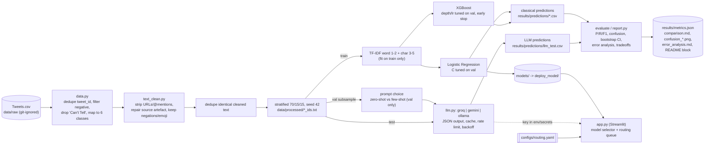

# Architecture

Key invariants
- The test split is identical for every model (saved as tweet_id lists) and is only *evaluated* in `evaluate`.
- The vectoriser is fitted on the training split only.
- LLM calls are cached on disk by (provider, model, prompt version + hash, mode, input): reruns are free and resumable across days.
- If the LLM branch cannot run, the pipeline records why and reports classical results only.
