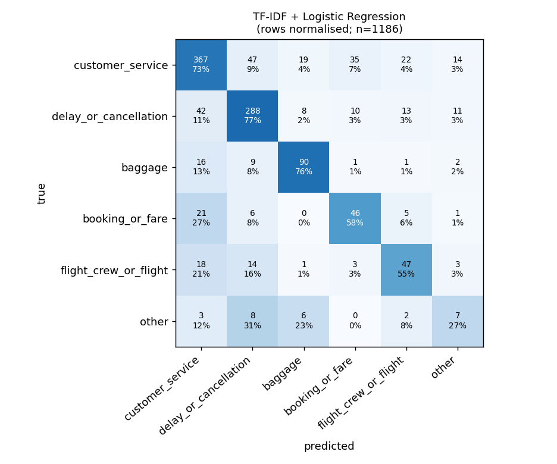
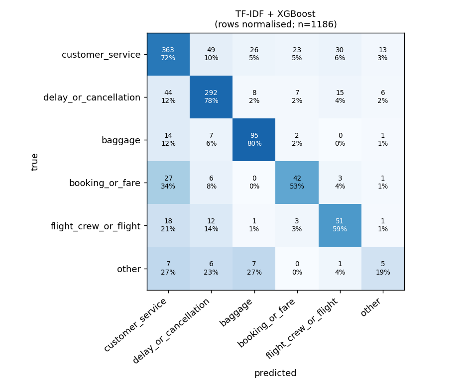

# Model comparison

Generated 2026-10-06 15:44:52 UTC from `results/predictions/*.csv`. Test items evaluated: 1186 of 1186.

| Model | Macro precision | Macro recall | Macro F1 | Weighted F1 | Accuracy | Parse failures (LLM) | Mean latency ms | Train time s (classical) | Rate-limited retries (LLM) |
|---|---|---|---|---|---|---|---|---|---|
| TF-IDF + Logistic Regression | 0.579 | 0.609 | 0.592 | 0.717 | 0.712 | n/a | 2.0 | 2.9 | n/a |
| TF-IDF + XGBoost | 0.581 | 0.603 | 0.591 | 0.716 | 0.715 | n/a | 1.7 | 250.2 | n/a |
| LLM (groq) | not run | not run | not run | not run | not run | not run | not run | n/a | not run |

Latency: classical = single-tweet prediction on 1 CPU core (n=300, includes cleaning + featurising); LLM = provider round-trip recorded at call time (excludes client-side rate-limit sleeps; free-tier queueing varies). Train time = vectoriser fit + final estimator fit (hyper-parameter search time is in `classical_train.json`).

> **LLM branch did not execute** - status `skipped`: GROQ_API_KEY is not set

## Bootstrap CI (best classical minus LLM)

No LLM-vs-classical comparison is available because the LLM branch did not complete (see RUN_LOG.md).

## Per-class metrics - TF-IDF + Logistic Regression

| class | precision | recall | F1 | support |
|---|---|---|---|---|
| customer_service | 0.786 | 0.728 | 0.756 | 504 |
| delay_or_cancellation | 0.774 | 0.774 | 0.774 | 372 |
| baggage | 0.726 | 0.756 | 0.741 | 119 |
| booking_or_fare | 0.484 | 0.582 | 0.529 | 79 |
| flight_crew_or_flight | 0.522 | 0.547 | 0.534 | 86 |
| other | 0.184 | 0.269 | 0.219 | 26 |

## Per-class metrics - TF-IDF + XGBoost

| class | precision | recall | F1 | support |
|---|---|---|---|---|
| customer_service | 0.767 | 0.720 | 0.743 | 504 |
| delay_or_cancellation | 0.785 | 0.785 | 0.785 | 372 |
| baggage | 0.693 | 0.798 | 0.742 | 119 |
| booking_or_fare | 0.545 | 0.532 | 0.538 | 79 |
| flight_crew_or_flight | 0.510 | 0.593 | 0.548 | 86 |
| other | 0.185 | 0.192 | 0.189 | 26 |

## Sensitivity: source-text artefact (logistic regression only, post-hoc)

15.9% of usable tweets contain an injected label string (208 of 1186 test tweets). TF-IDF+LR test macro-F1: repaired text **0.592** vs raw unrepaired text **0.590** (validation: 0.615 vs 0.618). Accuracy of the repaired model on test rows that had the artefact: 0.779, on the rest: 0.698.

## Interpretability: top n-grams per class (logistic regression weights)

| class | top features (w = word n-gram, c = char n-gram) |
|---|---|
| customer_service | `w:hold`, `w:on hold`, `w:phone`, `w:customer`, `w:service`, `c:hold` |
| delay_or_cancellation | `c: dela`, `c:delay`, `c:dela`, `c:elay`, `w:delayed`, `c: del` |
| baggage | `w:bag`, `c:bag`, `c: bag`, `c: ba`, `w:luggage`, `w:bags` |
| booking_or_fare | `w:book`, `c:book`, `c:boo`, `c:ook`, `w:$`, `c: book` |
| flight_crew_or_flight | `w:wifi`, `w:plane`, `w:seat`, `c:sea`, `c:seat`, `w:seats` |
| other | `w:line`, `c: line`, `c: lin`, `w:gate`, `w:people`, `w:in` |
